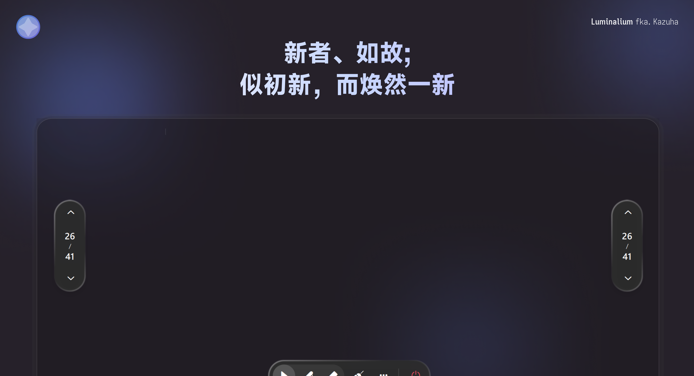

 

# Luminalium 2

  新者如故，似初新而焕然一新。 &emsp;&emsp; <b>简体中文</b> | <a href="/docs/lang/en_US.md">English</a> | <a href="/docs/lang/ja.md">日本語</a>

 

---

## 概述

Luminalium 2 是全新的 Luminalium 版本，在许多方面都进行了不小的改进和修改，并且基于比前代更新的架构和技术栈重写。

它看起来依旧熟悉，却已经在许多地方焕然一新了。

## 社区

## 开源许可

本项目基于 [MIT License](LICENSE) 获得许可。

## 致谢

### 依赖

Luminalium 2 站在这些优秀项目的肩膀上：

- **[Qt / PySide6](https://www.qt.io/)**
- **[RinUI](https://github.com/RinLit-233-shiroko/RinUI)** 
- **[pywin32](https://github.com/mhammond/pywin32)** 
- **[Fluent UI System Icons](https://github.com/microsoft/fluentui-system-icons)**
- 设计语言与交互体验继承自 **Luminalium 1** 并参考了一部分 **Class Widgets 2**。

### 贡献者

感谢所有为 Luminalium 2 做出贡献的人：

也感谢每一位提交 Issue、反馈建议与点亮 Star 的你。

## 星标历史

