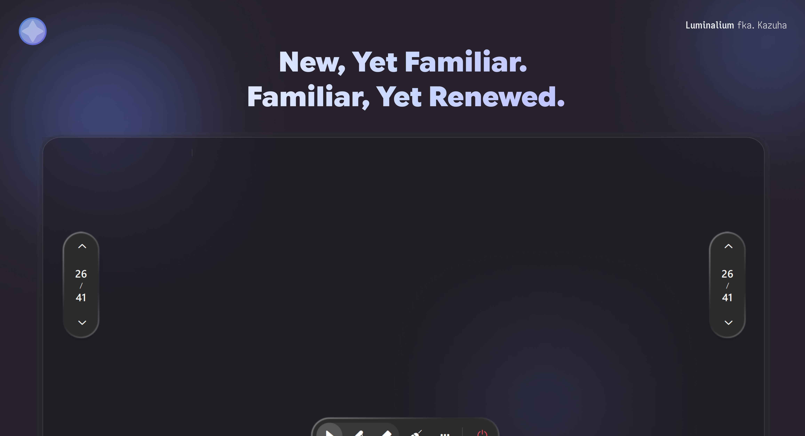

 

# Luminalium 2

  New, Yet Familiar. Familiar, Yet Renewed. &emsp;&emsp; <a href="/README.md">简体中文</a> | <b>English</b> | <a href="/docs/lang/ja.md">日本語</a>

 

---

## Overview

Luminalium 2 is a brand-new version of Luminalium, improved and revised in many respects, and rewritten on a newer architecture and tech stack than its predecessor.

It looks familiar, yet it has been renewed in many places.

## Community

## License

This project is licensed under the [MIT License](/LICENSE).

## Acknowledgements

### Dependencies

Luminalium 2 stands on the shoulders of these excellent projects:

- **[Qt / PySide6](https://www.qt.io/)**
- **[RinUI](https://github.com/RinLit-233-shiroko/RinUI)**
- **[pywin32](https://github.com/mhammond/pywin32)**
- **[Fluent UI System Icons](https://github.com/microsoft/fluentui-system-icons)**
- The design language and interaction experience are inherited from **Luminalium 1**, with some reference to **Class Widgets 2**.

### Contributors

Thanks to everyone who has contributed to Luminalium 2:

And thanks to everyone who filed an issue, gave feedback, or lit a star.

## Star History

