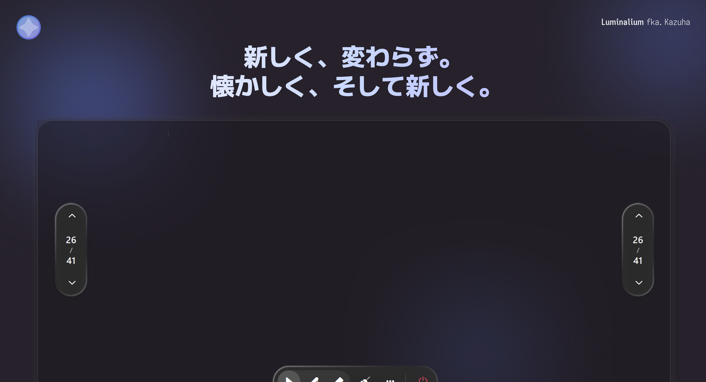

 

# Luminalium 2

  新しく、変わらず。 懐かしく、そして新しく。 &emsp;&emsp; <a href="/README.md">简体中文</a> | <a href="/docs/lang/en_US.md">English</a> | <b>日本語</b>

 

---

## 概要

Luminalium 2 はまったく新しい Luminalium です。多くの面で改善と改修が施され、前世代より新しいアーキテクチャと技術スタックで書き直されました。

見た目はどこか懐かしく、しかし多くの場所で新しく生まれ変わっています。

## コミュニティ

## ライセンス

本プロジェクトは [MIT License](/LICENSE) の下でライセンスされています。

## 謝辞

### 依存関係

Luminalium 2 は、これらの優れたプロジェクトの肩の上に立っています：

- **[Qt / PySide6](https://www.qt.io/)**
- **[RinUI](https://github.com/RinLit-233-shiroko/RinUI)**
- **[pywin32](https://github.com/mhammond/pywin32)**
- **[Fluent UI System Icons](https://github.com/microsoft/fluentui-system-icons)**
- デザイン言語と操作感は **Luminalium 1** から受け継ぎ、**Class Widgets 2** も一部参考にしています。

### コントリビューター

Luminalium 2 に貢献してくださったすべての方に感謝します：

Issue を立ててくれた方、フィードバックをくれた方、そして Star を灯してくれたすべての方にも感謝します。

## スター履歴

